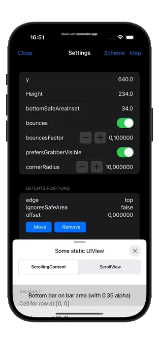

# DynamicBottomSheet

A highly customizable DynamicBottomSheet UIView for iOS apps, built using Swift. This Swift package provides a flexible and easy-to-integrate bottom sheet view that supports dynamic height selection, allowing developers to create adaptive and interactive UI experiences seamlessly.

### Features

* Dynamic Height Adjustment: Easily set and change the height of the bottom sheet based on your app's requirements.

* Smooth Animations: Experience seamless transitions with smooth, aesthetically pleasing animations.

* Customization Options: Tailor the appearance and behavior of the bottom sheet with a variety of configuration options.

### TODO: Documentation

> My code has no documentation. But it has strong character. — Jason Statham

## In the meantime, run the ExampleApp

